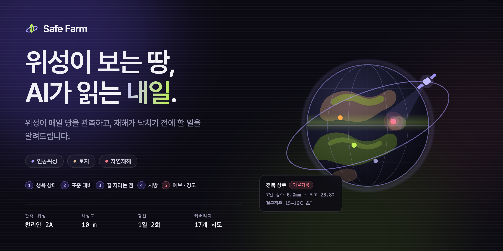
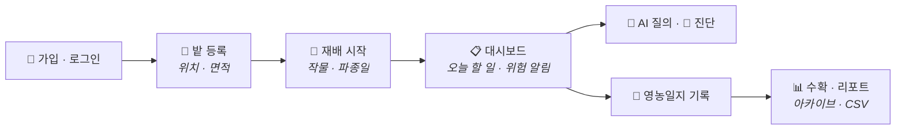
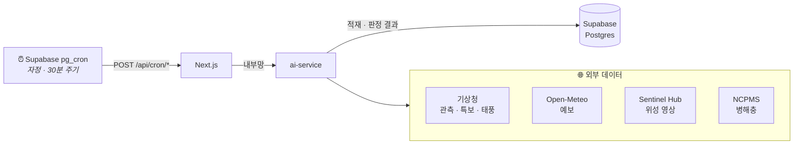
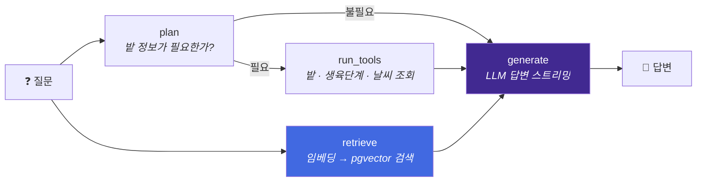
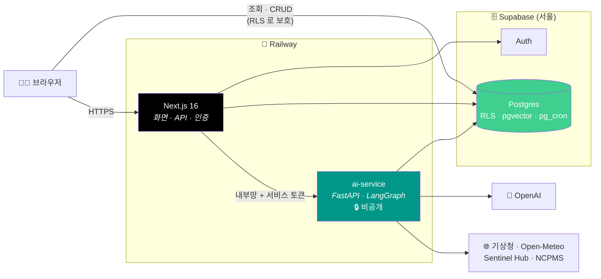

<div align="center">

# 🌾 Safe Farm AI

### 위성이 보는 땅, AI가 읽는 내일



**기후 · 위성 데이터로 농작물 위험을 미리 감지하고, AI가 내 밭에 맞는 대응책을 추천하는 농업 서비스**

**🔗 https://safe-farm-production.up.railway.app**

<br/>


<br/>


<br/>


<br/>

[**소개**](#-소개) · [**주요 기능**](#-주요-기능) · [**동작 흐름**](#-동작-흐름) · [**아키텍처**](#-시스템-아키텍처) · [**기술 스택**](#-기술-스택) · [**배포**](#-배포) · [**실행**](#-로컬-실행)

</div>

---

## 📌 소개

농가는 서리 · 폭염 · 태풍 같은 기상 위험을 **이미 피해가 난 뒤에** 알게 되는 경우가 많습니다.
Safe Farm AI 는 기상청 관측 · 예보, 기상특보, 위성 영상을 매일 모아 **내 밭이 있는 지역**의 위험을 먼저 알려 주고,
재배 중인 작물의 생육단계에 맞춰 **오늘 무엇을 해야 하는지**를 AI가 정리해 줍니다.

| 누구를 위한가 | 무엇을 해결하는가 |
|---|---|
| 🧑‍🌾 소규모 농가 | 흩어진 기상 · 병해충 정보를 한 화면에서, 내 밭 기준으로 |
| 🌱 귀농 · 초보 농업인 | "지금 무엇을 해야 하지?" 에 대한 생육단계별 행동 안내 |
| 🛠️ 운영자 | 데이터 수집 배치 · AI 답변 품질을 관리자 화면에서 점검 |

---

## ✨ 주요 기능

<table>
<tr>
<td width="33%" valign="top">

### 🗺️ 지역 위험 지도
시군구 단위로 **적산온도 · 강수 · 강풍 · 기상특보 · 태풍 경로**를 지도에 겹쳐 보여 줍니다.

</td>
<td width="33%" valign="top">

### 🌱 내 밭 · 재배 관리
밭 위치와 작물을 등록하면 실제 기온으로 **생육단계(GDD)** 를 계산하고, 영농일지를 기록 · CSV로 내보냅니다.

</td>
<td width="33%" valign="top">

### ✅ 오늘 할 일
매일 자정, 모든 밭의 날씨 · 생육단계를 판정해 **오늘 해야 할 작업 카드**를 만들어 둡니다.

</td>
</tr>
<tr>
<td valign="top">

### 💬 AI 질의응답
농업 문서 검색(RAG)과 **내 밭 정보**를 함께 넣어 답합니다. 답변마다 👍/👎 피드백을 남길 수 있습니다.

</td>
<td valign="top">

### 🐛 병해충 진단
증상을 설명하면 농촌진흥청 **NCPMS** 병해충 정보와 대조해 의심 병해충과 방제법을 제시합니다.

</td>
<td valign="top">

### 📊 생육 리포트 · 작물 추천
재배 기간의 기상 · 생육 이력을 리포트로 정리하고, 지역 기후에 맞는 **작물 · 품종**을 추천합니다.

</td>
</tr>
</table>

---

## 🔄 동작 흐름

### 사용자 여정



### 데이터는 이렇게 쌓입니다



| 배치 | 주기 | 하는 일 |
|---|---|---|
| `tasks` | 매일 00:00 KST | 모든 밭의 오늘 할 일 카드 생성 |
| `alerts` | 30분마다 | 기상청 기상특보 스냅샷 적재 |

### AI 질문 하나가 답이 되기까지

LangGraph 로 구성된 그래프가 **계획과 문서 검색을 동시에** 시작해 응답 대기 시간을 줄입니다.



---

## 🏗️ 시스템 아키텍처



| 구성 요소 | 역할 |
|---|---|
| **Next.js** | 화면 렌더링, 로그인 세션 관리, AI 요청 중계, 배치 수신 |
| **ai-service** | LLM 호출 · RAG 검색 · 생육/위험 판정 · 외부 데이터 수집. **공개 인터넷에 노출하지 않음** |
| **Supabase** | 사용자 인증, 모든 데이터 저장, 벡터 검색, 배치 스케줄링 |

**설계 포인트**
- 🔒 **AI 서버는 비공개** — LLM 비용이 드는 엔드포인트라 Railway 내부망으로만 접근하고, 서비스 토큰으로 한 번 더 인증합니다.
- 🛡️ **권한은 DB 에서** — 브라우저가 DB 에 직접 붙어도 Postgres RLS 가 본인 데이터만 허용합니다. 관리자 역할은 사용자가 수정할 수 없는 `app_metadata` 에서 읽습니다.
- 🧩 **기능 단위 수직 분할** — 화면 · 로직 · 저장을 기능(`plots`, `ask`, `weather` …) 별로 묶어, 기능끼리 서로 의존하지 않게 했습니다.

---

## 🧰 기술 스택

| 영역 | 기술 |
|---|---|
| **Frontend** | Next.js 16 (App Router) · React 19 · TypeScript · Tailwind CSS v4 · three.js (React Three Fiber) · Kakao Map |
| **Backend (Web)** | Next.js Route Handler · Server Action · Supabase SSR |
| **AI Server** | Python 3.12 · FastAPI · LangGraph · LangChain · OpenAI · SQLAlchemy · tiktoken |
| **Database** | Supabase Postgres · pgvector (벡터 검색) · pg_cron / pg_net (배치) · Row Level Security |
| **Auth** | Supabase Auth (세션 쿠키) |
| **Data Source** | 기상청 API · Open-Meteo · Sentinel Hub · NCPMS (농촌진흥청 병해충) |
| **Infra** | Railway (Docker) · Supabase (ap-northeast-2, 서울) |
| **Quality** | Vitest · pytest · Biome · Ruff |

---

## 🚀 배포

| 서비스 | 플랫폼 | 방식 |
|---|---|---|
| 웹 (Next.js) | Railway | 루트 `Dockerfile` 로 빌드, 공개 도메인 |
| AI 서버 (FastAPI) | Railway | `ai-service/Dockerfile` 로 빌드, **내부망 전용** |
| DB · Auth · 배치 | Supabase | 서울 리전, 스키마는 `supabase/migrations/` 로 관리 |

```
feature/* ──▶ development ──▶ production
               (개발 환경)      (운영 배포)
```

작업은 `feature/*` 브랜치에서 진행하고, `development` 에서 검증한 뒤 `production` 으로 승격합니다.

---

## 📁 프로젝트 구조

```
Safe-Farm/
├── src/                       # Next.js 웹
│   ├── app/                     라우팅 (화면 · API)
│   │   ├── (app)/                 사용자 화면 — 대시보드 · 밭 · 지도 · 날씨 · AI 질의 · 마이페이지
│   │   ├── (admin)/               관리자 화면 — 회원 · 작물 · 배치 · 답변 품질
│   │   └── api/                   AI 중계 · 지도 데이터 · 배치 수신
│   ├── features/                기능별 로직 (plots · cultivations · ask · diagnose · report …)
│   ├── components/              화면 조각
│   └── shared/                  공용 (Supabase · 인증 · AI 클라이언트 · 지도)
│
├── ai-service/                # Python AI 서버
│   ├── app/
│   │   ├── api/                   REST 엔드포인트 (ask · diagnose · recommend · weather …)
│   │   ├── graph/                 LangGraph 그래프
│   │   ├── knowledge/             RAG — 청킹 · 임베딩 · 검색 · 재정렬
│   │   └── service/ · domain/     판정 로직 (생육단계 · 작물 위험 · 할 일)
│   └── pipeline/                  외부 데이터 수집 · 적재
│
├── supabase/migrations/       # DB 스키마 · RLS 정책 · 배치 스케줄
└── docs/                      # 아키텍처 문서
```

---

## 💻 로컬 실행

**요구 사항:** Node.js 22+ · Python 3.10+ · Supabase 프로젝트

```bash
# 1. 웹
npm install
cp .env .env.local        # 값 채우기
npm run dev               # http://localhost:3000

# 2. AI 서버
cd ai-service
python -m pip install -e ".[dev]"
```

AI 서버 실행 · 데이터 적재는 [ai-service/README.md](./ai-service/README.md) 를 참고하세요.

---

## 📚 더 보기

| 문서 | 내용 |
|---|---|
| [docs/architecture/service-communication.md](./docs/architecture/service-communication.md) | Next ↔ AI 서버 통신 규약 |
| [docs/architecture/pii-masking.md](./docs/architecture/pii-masking.md) | 개인정보 마스킹 |
| [ai-service/README.md](./ai-service/README.md) | AI 서버 개발 가이드 |
| [AGENTS.md](./AGENTS.md) | 개발 규칙 · 커밋 컨벤션 |
