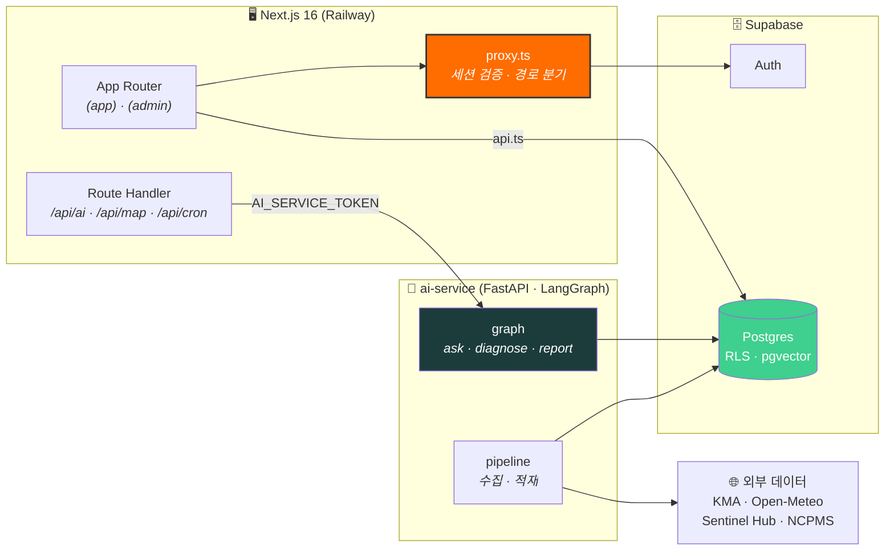

<div align="center">

# 🌾 Safe Farm AI

### 위성이 보는 땅, AI가 읽는 내일


**기후 · 위성 데이터로 농작물 위험을 감지하고, LLM 이 내 밭에 맞는 개선책을 추천합니다.**<br/>
**https://safe-farm-ai.web.app**

<br/>


<br/>


<br/>

[**빠른 시작**](#-빠른-시작) · [**시스템 구조**](#-시스템-구조) · [**폴더 구조**](#-폴더-구조) · [**규칙**](#-규칙) · [**보안**](#-보안--지키지-않으면-사고가-나는-것) · [**브랜치**](#-브랜치-전략)

</div>

---

## ✨ 주요 기능

<table>
<tr>
<td width="33%" valign="top">

### 🛰️ 위험 감지
기상청 · Open-Meteo 기상과 Sentinel 위성 관측으로 시군구 단위 적산온도 · 강수 · 강풍 · 태풍 경보를 지도에 띄웁니다.

</td>
<td width="33%" valign="top">

### 🌱 내 밭 생육 관리
밭 · 작물 · 재배를 등록하면 실제 기온으로 GDD 생육단계를 계산하고, 영농일지를 CSV 로 내보냅니다.

</td>
<td width="33%" valign="top">

### 🤖 AI 질의응답 · 리포트
LangGraph 가 내 밭 컨텍스트를 주입해 답하고, NCPMS 병해충 정보로 진단 · 생육 리포트를 만듭니다.

</td>
</tr>
</table>

---

## 🏗️ 시스템 구조



---

## 🚀 빠른 시작

### 요구 사항

| 항목 | 버전 |
|---|---|
| Node.js | 22 이상 |
| Python | 3.10 이상 (`ai-service/`) |
| Supabase | **Northeast Asia (Seoul) / ap-northeast-2** 리전 |

### 1️⃣ 웹

```bash
npm install
cp .env .env.local     # 실제 키는 .env.local 에 (git 추적 안 됨)
npm run dev            # http://localhost:3000
```

> [!NOTE]
> `.env` 는 플레이스홀더 템플릿이고 git에 추적됩니다. 실제 값은 `.env.local` 에만 채우세요.

### 2️⃣ AI 서버

```bash
cd ai-service && python -m pip install -e ".[dev]"
```

> [!IMPORTANT]
> **`-e` 를 빼지 마세요.** 빼면 `app/` · `pipeline/` 이 sys.path 에 안 올라갑니다.
> 자세한 내용은 [ai-service/README.md](./ai-service/README.md).

<details>
<summary><b>🔧 명령 전체</b></summary>
<br/>

| 명령 | 하는 일 |
|---|---|
| `npm run dev` | 개발 서버 (3000) |
| `npm run build` | 프로덕션 빌드 |
| `npm test` | Vitest 1회 실행 |
| `npm run test:watch` | 변경 감지 |
| `npm run typecheck` | `tsc --noEmit` |
| `npm run lint` | Biome (린트 + 포맷 검사) |
| `npm run format` | Biome 포맷 적용 |

</details>

---

## 📁 폴더 구조

```
src/
├── app/                       라우팅 전용. 로직 금지
│   ├── layout.tsx               <html>/<body>/globals.css
│   ├── globals.css              디자인 토큰 전부 (3층 구조)
│   ├── (app)/                   사용자 셸 — URL에 안 나타남
│   ├── (admin)/                 관리자 셸 + 접근 차단
│   └── login/                   로그인 (셸 없음)
│
├── proxy.ts                   세션 갱신. 지우면 안 됨 (아래 참조)
│
├── components/                화면 조각
│   ├── shared/                  Button, Card — 도메인을 몰라야 함
│   └── <feature>/               피쳐 전용. 도메인 의미는 여기서 입힘
│
├── features/<도메인>/          로직. 화면 아님
│   ├── domain/                  순수 함수 + 테스트  ← 여기가 제품의 핵심
│   ├── graph/                   LangGraph (있는 경우)
│   ├── api.ts                   브라우저 → Supabase 직결
│   ├── actions.ts               'use server' — 얇게
│   ├── server/                  DAL (인가 + 소유권 검사)
│   └── types.ts
│
└── shared/                    전 피쳐 공용
    ├── supabase/                client(브라우저) / server(서버) / proxy(세션갱신)
    ├── auth/session.ts          getViewer · requireUser · requireAdmin
    ├── langgraph/               checkpointer 배선
    └── utils/                   format.ts 등 — 파일명이 책임을 말해야 함

supabase/
└── migrations/                *.sql — YYYYMMDDHHmmss_name.sql (UTC)

ai-service/                    Python AI 서버 (FastAPI · LangGraph)
├── app/                         api · graph · domain · repo
└── pipeline/                    기상 · 위성 · 문서 수집 → 적재
```

### 새 파일을 어디에 둘 것인가

| 만들려는 것 | 위치 |
|---|---|
| 새 화면(URL) | `app/(app)/<경로>/page.tsx` — 조립만 |
| 여러 곳에서 쓰는 버튼·입력·카드 | `components/shared/` |
| 특정 기능 전용 화면 조각 | `components/<feature>/` |
| 계산·판정·변환 로직 | `features/<도메인>/domain/` + **테스트 같이** |
| 브라우저에서 하는 조회 | `features/<도메인>/api.ts` |
| 비밀이 필요한 서버 작업 | `features/<도메인>/actions.ts` + `server/` |
| DB 스키마 변경 | `npx supabase migration new <이름>` |
| 여러 피쳐가 쓰는 헬퍼 | `shared/utils/<목적>.ts` |

> [!TIP]
> **`utils.ts` 같은 파일은 만들지 않습니다.** 목적별로 쪼개세요 (`format.ts`, `date.ts`).

---

## 📐 규칙

### 의존성은 단방향

```
shared  →  features  →  app
```

features끼리 import 금지 — 조합은 `app/`에서 합니다. `components/shared/` 는 도메인
타입을 import하지 않습니다(그래야 재사용됩니다).

### MVC 아님

`controllers/` `models/` `views/` 를 만들지 마세요. App Router는 계층이 아니라
**실행 경계**(서버/클라이언트)로 나뉩니다. 기능 단위 수직 분할을 씁니다.

### 통신 방법 4가지

| 상황 | 방법 |
|---|---|
| 일반 조회·CRUD·실시간 | 브라우저 → Supabase 직결 (`features/*/api.ts`) |
| 폼 제출·변경 중 비밀 필요 | Server Action (`features/*/actions.ts`) |
| 스트리밍·웹훅·외부 호출 | Route Handler (`app/api/*/route.ts`) |
| 정적 셸·레이아웃 | Server Component |

### 스타일은 토큰만

```tsx
<div className="bg-surface text-fg border-border" />   // ✅
<div className="bg-white text-gray-900" />              // ❌ 다크모드 깨짐
```

토큰은 `src/app/globals.css` 3층 구조입니다:
원시 팔레트(`--leaf-*`) → 시맨틱(`--fg`, `--accent`) → `@theme inline` 유틸리티.
컴포넌트는 **시맨틱만** 씁니다.

### 테스트는 `domain/` 에만

`domain/` 순수 함수와 LangGraph 조건부 엣지에만 씁니다. 컴포넌트 렌더링 테스트,
스냅샷, Supabase 연동 목킹은 하지 않습니다 — 유지비가 가치를 넘습니다.

> [!NOTE]
> async Server Component는 Vitest 공식 미지원입니다. 그쪽 검증이 필요해지면
> Playwright를 그때 추가합니다.

---

## 🔒 보안 — 지키지 않으면 사고가 나는 것

### `src/proxy.ts` 를 지우지 마세요

Server Component는 쿠키를 쓸 수 없어 **여기서만** 토큰을 갱신할 수 있습니다.
없으면 사용자가 무작위로 로그아웃됩니다.

> [!WARNING]
> `config.matcher` 의 **정적 확장자 목록**도 지우지 마세요. 빠뜨리면 `public/` 에셋이
> `/login` 으로 리다이렉트되어 `Unexpected token '<'` 로 죽습니다.

`shared/supabase/proxy.ts` 의 `setAll` 은 **요청과 응답 양쪽에** 씁니다 — 응답
헤더를 빠뜨리면 인증된 응답이 CDN에 캐시되어 **세션이 샙니다.**

### 역할은 `app_metadata`

```ts
claims.app_metadata.role   // ✅ service_role 로만 변경 가능
claims.user_metadata.role  // ❌ 사용자가 직접 고칠 수 있음
```

### Server Action = 공개 엔드포인트

`'use server'` 파일의 **export 하나하나가 직접 POST 가능한 공개 엔드포인트**입니다.
UI에 폼을 안 그려도 호출됩니다.

- 헬퍼·타입·상수를 같은 파일에서 export하지 마세요
- 모든 액션 첫 줄에서 `requireUser()` / `requireAdmin()` 을 다시 부르세요
- 페이지·레이아웃의 권한 검사는 **액션까지 이어지지 않습니다**
- 삭제·수정은 `.eq("owner_id", user.id)` 로 소유권을 함께 거세요 (IDOR 방어)

### 마이그레이션은 3종 세트

```sql
grant ... on <table> to authenticated;
alter table <table> enable row level security;
create policy ... on <table> ...;
```

SQL 에디터·마이그레이션·MCP로 만든 테이블은 **RLS가 자동으로 켜지지 않습니다.**
로컬(`supabase start`)은 anon 자동 노출이 기본이라 **로컬만 되고 프로덕션에서
죽는** 일이 흔합니다.

> [!CAUTION]
> PostgREST가 42501 에러와 함께 주는 `GRANT ... TO anon` 힌트를 그대로 따르지
> 마세요. RLS가 꺼진 테이블에 실행하면 그 즉시 전체 공개됩니다.

### 환경변수 경계

| 변수 | 브라우저 |
|---|:---:|
| `NEXT_PUBLIC_SUPABASE_URL` | ✅ |
| `NEXT_PUBLIC_SUPABASE_ANON_KEY` | ✅ RLS가 방어선 |
| `SUPABASE_SERVICE_ROLE` | ❌ RLS 우회 |
| `AI_SERVICE_TOKEN` | ❌ AI 서버 인증 |

`NEXT_PUBLIC_` 접두가 붙은 값은 **빌드 시 번들에 문자열로 박혀** 전 세계에
공개됩니다. 변수 이름이 아니라 **접두만** 판단 기준입니다.

---

## 🌿 브랜치 전략

```
feature/* → development → production
```

- `feature/*` 는 `development` 기준으로 생성
- `development` / `production` 에 직접 커밋 금지
- `development` 검증 후 `production` 으로 승격

상세와 에이전트용 규칙은 [AGENTS.md](./AGENTS.md) 참조.
