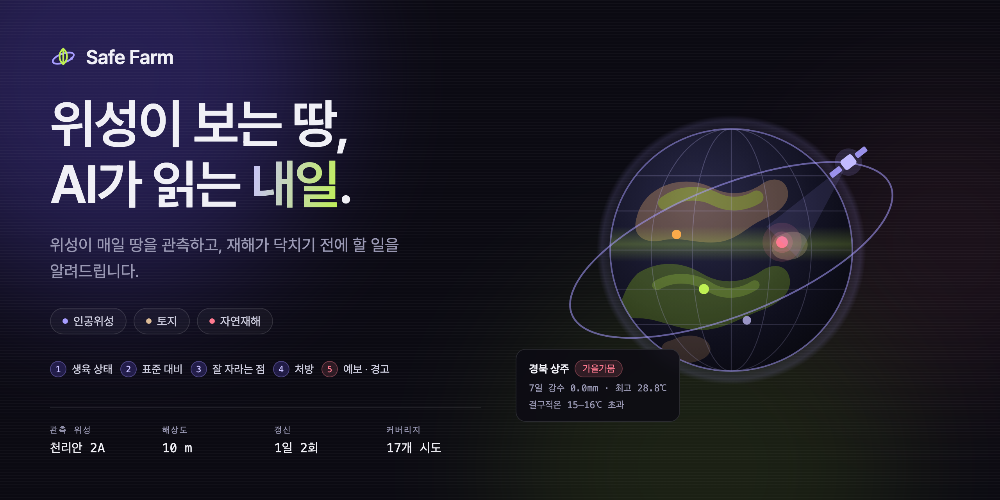
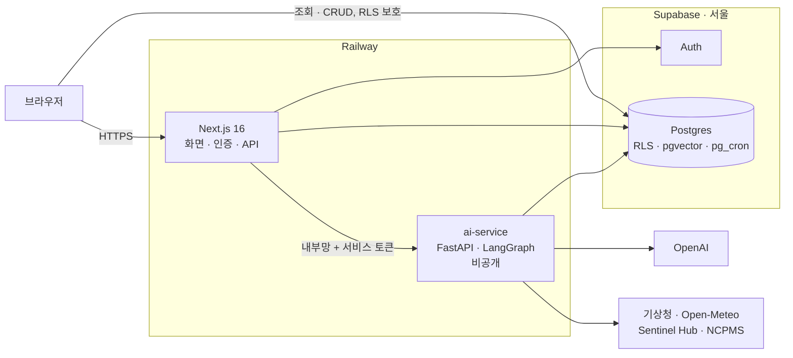
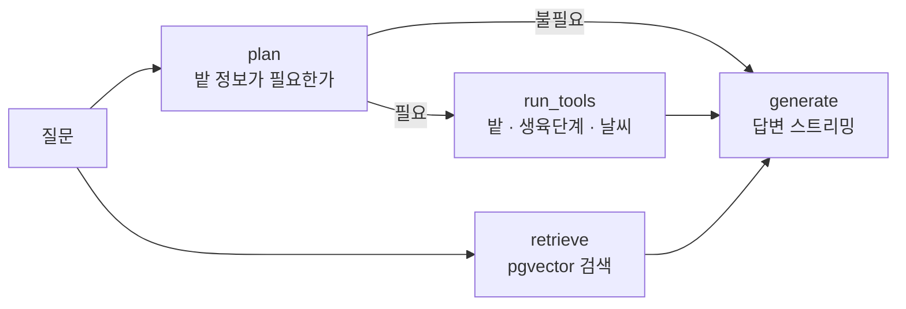

<div align="center">



# Safe Farm AI

기상 · 위성 데이터로 농작물 위험을 먼저 알려 주고,<br/>
내 밭의 생육단계에 맞춰 할 일을 정리해 주는 농업 서비스

[서비스 바로가기](https://safe-farm-production.up.railway.app)


</div>

<br/>

## 소개

서리 · 폭염 · 태풍 같은 기상 위험은 대개 피해가 난 뒤에야 알게 됩니다.
Safe Farm AI는 기상청 관측 · 예보, 기상특보, 위성 영상을 매일 모아 **내 밭이 있는 지역**의 위험을 먼저 보여 주고,
재배 중인 작물의 생육단계에 맞춰 **오늘 해야 할 일**을 정리합니다.

## 주요 기능

| 기능 | 설명 |
|---|---|
| **지역 위험 지도** | 시군구 단위로 적산온도 · 강수 · 강풍 · 기상특보 · 태풍 경로를 지도에 겹쳐 표시 |
| **밭 · 재배 관리** | 실제 기온으로 생육단계(GDD)를 계산하고, 영농일지를 기록 · CSV로 내보내기 |
| **오늘 할 일** | 매일 자정 모든 밭의 날씨와 생육단계를 판정해 작업 카드 생성 |
| **AI 질의응답** | 농업 문서 검색(RAG)에 내 밭 정보를 더해 답변, 답변별 피드백 수집 |
| **병해충 진단** | 증상 설명을 농촌진흥청 NCPMS 병해충 정보와 대조해 의심 병해충과 방제법 제시 |
| **생육 리포트 · 작물 추천** | 재배 기간의 기상 · 생육 이력을 리포트로 정리하고, 지역 기후에 맞는 작물 · 품종 추천 |

**사용 흐름** &nbsp; 가입 → 밭 등록 → 재배 시작(작물 · 파종일) → 대시보드에서 할 일 · 위험 확인 → 영농일지 기록 → 수확 후 리포트

## 아키텍처


```mermaid
flowchart LR
    U[브라우저] -->|HTTPS| WEB

    subgraph Railway
        WEB[Next.js 16<br/>화면 · 인증 · API]
        AI[ai-service<br/>FastAPI · LangGraph<br/>비공개]
        WEB -->|내부망 + 서비스 토큰| AI
    end

    subgraph Supabase[Supabase · 서울]
        AUTH[Auth]
        PG[(Postgres<br/>RLS · pgvector · pg_cron)]
    end

    U -->|조회 · CRUD, RLS 보호| PG
    WEB --> AUTH
    WEB --> PG
    AI --> PG
    AI --> LLM[OpenAI]
    AI --> EXT[기상청 · Open-Meteo<br/>Sentinel Hub · NCPMS]
```

- **AI 서버는 공개하지 않습니다.** LLM 비용이 드는 엔드포인트라 Railway 내부망으로만 받고, 서비스 토큰으로 한 번 더 인증합니다.
- **권한은 DB가 판단합니다.** 브라우저가 DB에 직접 붙어도 RLS가 본인 데이터만 허용하고, 관리자 역할은 사용자가 고칠 수 없는 `app_metadata`에서 읽습니다.
- **기능 단위로 나눴습니다.** 화면 · 로직 · 저장을 `plots`, `ask`, `weather` 같은 기능별로 묶고, 기능끼리는 서로 import하지 않습니다.

### AI 질의응답 그래프

계획과 문서 검색을 동시에 시작해 첫 응답까지의 대기 시간을 줄였습니다.


```mermaid
flowchart LR
    Q[질문] --> P[plan<br/>밭 정보가 필요한가]
    Q --> R[retrieve<br/>pgvector 검색]
    P -->|필요| T[run_tools<br/>밭 · 생육단계 · 날씨]
    P -->|불필요| G
    T --> G[generate<br/>답변 스트리밍]
    R --> G
```

### 배치

Supabase `pg_cron`이 Next.js `/api/cron/*`를 호출하면, Next.js가 내부망으로 ai-service에 넘겨 처리합니다.

| 배치 | 주기 | 내용 |
|---|---|---|
| `tasks` | 매일 00:00 KST | 모든 밭의 오늘 할 일 카드 생성 |
| `alerts` | 30분 | 기상청 기상특보 스냅샷 적재 |

## 기술 스택

| 영역 | 사용 기술 |
|---|---|
| Frontend | Next.js 16 (App Router), React 19, TypeScript, Tailwind CSS v4, React Three Fiber, Kakao Map |
| AI Server | Python 3.12, FastAPI, LangGraph, LangChain, OpenAI, SQLAlchemy |
| Database | Supabase Postgres, pgvector, pg_cron, Row Level Security |
| Data | 기상청 API, Open-Meteo, Sentinel Hub, NCPMS |
| Infra | Railway (Docker), Supabase (서울 리전) |
| Quality | Vitest, pytest, Biome, Ruff |

## 프로젝트 구조

```
src/
  app/            라우팅 — (app) 사용자 화면, (admin) 관리자 화면, api
  features/       기능별 로직 (plots, cultivations, ask, diagnose, report …)
  shared/         Supabase · 인증 · AI 클라이언트 등 공용 코드
ai-service/
  app/            API, LangGraph 그래프, RAG, 생육 · 위험 판정
  pipeline/       외부 데이터 수집 · 적재
supabase/
  migrations/     스키마 · RLS 정책 · 배치 스케줄
```

## 로컬 실행

Node.js 22+, Python 3.10+, Supabase 프로젝트가 필요합니다.

```bash
# 웹
npm install
cp .env .env.local    # 값 채우기
npm run dev           # http://localhost:3000

# AI 서버
cd ai-service
python -m pip install -e ".[dev]"
```

AI 서버 실행과 데이터 적재는 [ai-service/README.md](./ai-service/README.md)를 참고하세요.

## 더 보기

- [개발 규칙](./AGENTS.md) — 브랜치 전략, 아키텍처 · 보안 규칙, 커밋 컨벤션
- [ai-service 개발 가이드](./ai-service/README.md) — 설치, 테스트, 데이터 적재
